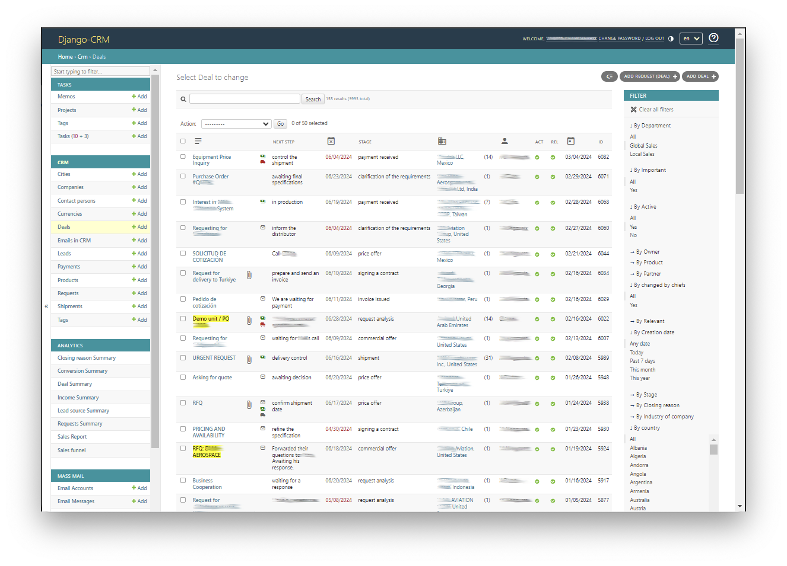

# Django-CRM

*(Customer Relationship Management)*

The use of CRM by companies allows them to improve the sales performance of their products and services.  The more complex and time-consuming the sales process, the greater the improvement.  
This [CRM](https://github.com/DjangoCRM/django-crm) is designed for individual use by any company. Access to the company's business data remains solely under its control.

Django CRM is an open-source [Django](https://www.djangoproject.com/start/overview/)-based project. It is written in [Python](https://www.python.org) (python crm).
Frontend and backend are almost entirely based on the Django [Admin site](https://docs.djangoproject.com/en/dev/ref/contrib/admin/).
CRM uses adaptive Admin HTML templates out-of-the-box.
Django is an excellently documented framework with lots of examples.
The documentation on the Admin site takes up only one web page.  
The **original idea** is that since Django Admin is already a professional object management interface with a flexible permissions system for users (view, change, add, and delete objects), all you need to do is create models for the objects (such as Leads, Requests, Deals, Companies, etc.) and add business logic.      

All this ensures:
- significantly easier project customization and development;
- simpler project deployment and production server support.

The **project code is stable** (has been in practical use for many years).

## Main applications
CRM the project consists of the following **main applications**:

- TASKS:
  - Task
    - subtasks;
  - Memo
    - tasks / project
  - Project (*tasks collection*):
    - tasks
  - Tags;
  - … (+ *3 more models*).
- CRM:
  - Requests;
  - Leads;
  - Companies;
  - Contact persons;
  - Deals;
  - Emails;
  - Products;
  - Payments;
  - … (+ *12 more models*).
- ANALYTICS
  - Income Summary report;
  - Sales funnel report;
  - Lead source Summary report;
  - … (+ *5 more reports*).
- MASS MAIL:
  - Email Accounts;
  - Email Messages;
  - Email Signatures;
  - Mailing Outs.

## Supporting applications
The project also contains **supporting applications** such as:

Chat, VoIP, Help, …

In total, at the moment, there are 79 tables in the database.

## Additional functionality
- Web form integration.
  - CRM form has built-in reCAPTCHA v3 protection;
  - Automatic detection of the country and city of the user who filled out the form;
- User’s email account integration;
- VoIP callback to smartphone;
- Sending messages via messengers (like: Viber, WhatsApp, Skype).
- Work with Excel files to import / export company contact details.

## Email client
There is a built-in Email client using **SMTP** and **IMAP** protocols.
Among other things, this allows the Django CRM to automatically save a copy of all correspondence for each request and deal in its database. Even if the correspondence was carried out in the user’s mail account (out of the CRM). The ticket mechanism is used for this.

CRM is able to work with email accounts **protected by two-factor authentication,** like gmail.

## User Assistance
- On the CRM pages, there is a link to a help page.
  Help pages are dynamic. Their content depends on the user's role.
- Tooltips appear when you hover the mouse over many page elements, such as icons, buttons, links, table headings, etc.
- There is also a user guide file.

## Project localization

Django CRM has [full support](https://docs.djangoproject.com/en/dev/topics/i18n/) for translation of interface, formatting of dates, times and time zones.

## Getting started

This project is deployed as a regular django project.

Please refer to:
- [the CRM installation and configuration guide](docs/installation_and_configuration_guide.md);
- [the Django-CRM user guide](docs/django-crm_user_guide.md).

Compatibility  
- Django 5.0.x
- Python 3.10+
- MySQL 8.0.11+ and PostgreSQL 12+

## Contributing
All types of contributions are welcome.

## Credits

- Uses Google material [icons](https://fonts.google.com/icons).
- Includes [NicEdit](https://nicedit.com) - WYSIWYG Content Editor.

