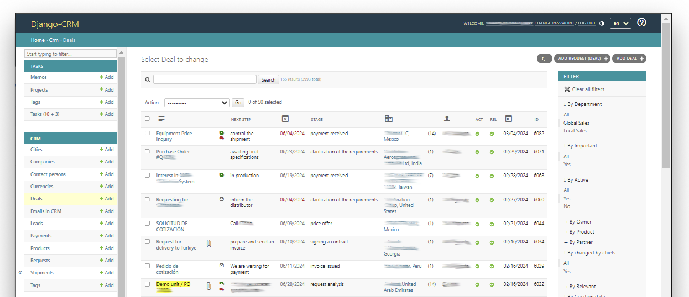

# {target="_blank"} Welcome to Django-CRM Documentation

[Django CRM](https://github.com/DjangoCRM/django-crm/){target="_blank"} (client relationship software) is an open source application with web interface.  
This CRM is based on the [Django Admin site](https://docs.djangoproject.com/en/dev/ref/contrib/admin/){target="_blank"} and is written in the [Python](https://www.python.org/){target="_blank"} programming language.

{target="_blank"}

<a class="btn button" href="/en/latest/installation/">CRM installation</a>
<a class="btn button" href="/en/latest/introduction/">User guide</a>

 

Django CRM offers a comprehensive CRM solution and consists of the following core applications:

- __TASKS__ ([CRM task management](https://djangocrm.github.io/info/features/tasks-app-features/){target="_blank"}: management of tasks, projects, memos)
- __CRM__ ([CRM Application](https://djangocrm.github.io/info/features/crm-app-features/){target="_blank"}: management of leads, contacts, companies, deals, products, etc.)
- __ANALYTICS__ ([CRM Analytics software](https://djangocrm.github.io/info/features/analytics-app-features/){target="_blank"}: sales funnel and other seven reports)
- __MASS MAIL__ ([CRM email marketing](https://djangocrm.github.io/info/features/massmail-app-features/){target="_blank"}: free mass email sender)

The CRM task management does not require configuration and allows individual users or teams to work with the following objects and objects associated with them:

- [Tasks](tasks_section.md#tasks) -> Subtasks
- Projects -> Tasks -> Subtasks
- [Memos](tasks_section.md#memos) (office memos) -> Projects or Tasks 

Each instance of these objects also has integration with:

- [ Chat](tasks_section.md#chat-in-objects)
-   Tags
-  Remainders
- [ Files](introduction.md#file-object)

Notifications within CRM system and to Email are also available.  
All CRM users have access to this application by default.

Access to the rest of the Django CRM applications is only available to users with the appropriate [roles](adding_crm_users.md#user-groups-roles), such as [sales managers](guide_for_sales_manager.md), [company executives](guide_for_company_executives.md), etc.  
To use all the features of these applications, you need to set up __CRM software integration__:

- with your company's websites
- with your company's mailboxes and sales managers' mailboxes
- if necessary:
    - with the service of receiving [currency](currencies.md) exchange rates
    - with VoIP telephony service 

---
