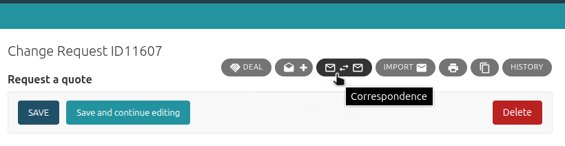

# Run CRM using the built-in server

!!! Note
    Don't use this server in anything resembling a production environment (with access to the CRM from the Internet).  
    It is intended only for use on a personal computer or in intranet - a private local network (for example, during development).

The built-in server can only be used when `DEBUG = True` (the default setting).  

## Run CRM on localhost

``` cmd
python manage.py runserver
```

In this case, CRM will be available on your computer on the IP address `http://127.0.0.1:8000` (localhost with port 8000).  
But if you open the web page at this address in your browser, you will see an error page.
The login address for CRM is listed below, in the ["Access to CRM and admin sites"](#access-to-crm-and-admin-sites) section.

You may encounter log messages such as:  
`Another instance is already running, quitting.`  
This behavior is expected and requires no intervention.  
Django CRM operates as a self-hosted web application where the server may spawn multiple worker processes to handle concurrent tasks. However, certain internal services within the CRM are designed to run as a single instance to maintain data integrity or avoid conflicts. To enforce this, duplicate instances of these services are automatically detected and terminated during startup.

## Run CRM on a specific IP address and port

If you need to provide access to CRM from an intranet (local network), specify the IP address of your network card and port.

!!! Important
    But first, [specify the CRM website domain](#specify-crm-site-domain).

For example:

```cmd
python manage.py runserver 1.2.3.4:8000
```

## Access to CRM and admin sites

Now you have two websites.  
Use the superuser credentials to log in.  

CRM site for all users:  
`http://127.0.0.1:8000/en/123/`  
It's according to the template  
`<your CRM host>/<LANGUAGE_CODE>/<SECRET_CRM_PREFIX>`

and Admin site for administrators (superusers):  
`http://127.0.0.1:8000/en/456-admin`  
`<your CRM host>/<LANGUAGE_CODE>/<SECRET_ADMIN_PREFIX>`

`LANGUAGE_CODE`, `SECRET_CRM_PREFIX` and `SECRET_ADMIN_PREFIX`
can be changed in the file `webcrm/settings.py`

!!! Note 
    Do not attempt to access the bare `<your CRM host>` address (`http://127.0.0.1:8000/`).  
    This address is not supported.  
    To protect CRM with a site server (e.g. [Apache](https://httpd.apache.org/){target="_blank"}), a redirect to a fake login page can be placed on this address.

## Specify CRM site domain

By default, CRM software is configured to work on a domain "localhost" (ip: 127.0.0.1).  
To work on another domain (or IP address), you need to do the following:  

- In the SITES section for administrators (superusers):  
`(ADMIN site) Home > Sites > Sites`  
Add a CRM site and specify its domain name.
- In the file `webcrm/settings.py`:
  - add it to the setting `ALLOWED_HOSTS`
  - the site ID can be changed at will in the setting `SITE_ID`

## Built-in assistance system

Many buttons and icons on CRM pages have tooltips that appear when you hover over them with your mouse.



Many pages have an icon <span style="vertical-align: baseline"></span> in the upper right corner.  
This is a link to a help page.
